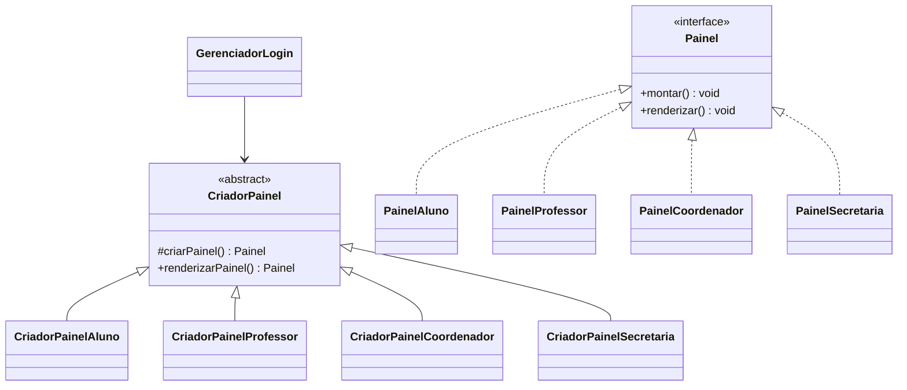

# SIGA — Factory Method

Atividade prática de TP2: refatoração de painéis por perfil usando Simple Factory e Factory Method.

## Execução

Requer JDK 17 ou superior.

```bash
javac -d bin src/siga/*.java
java -cp bin siga.Main
```

## Solução

`GerenciadorLogin` recebe um `CriadorPainel` e delega a criação ao método polimórfico `criarPainel()`. Ele não possui `if/else` nem instancia painéis concretos.



## Demonstração do OCP

O perfil `SECRETARIA` é criado por `PainelSecretaria` e `CriadorPainelSecretaria`, sem modificar `GerenciadorLogin` nem os criadores existentes.
